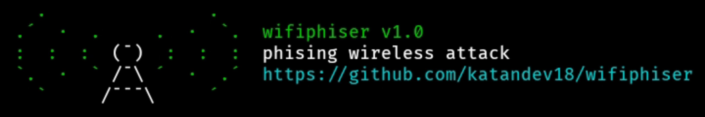
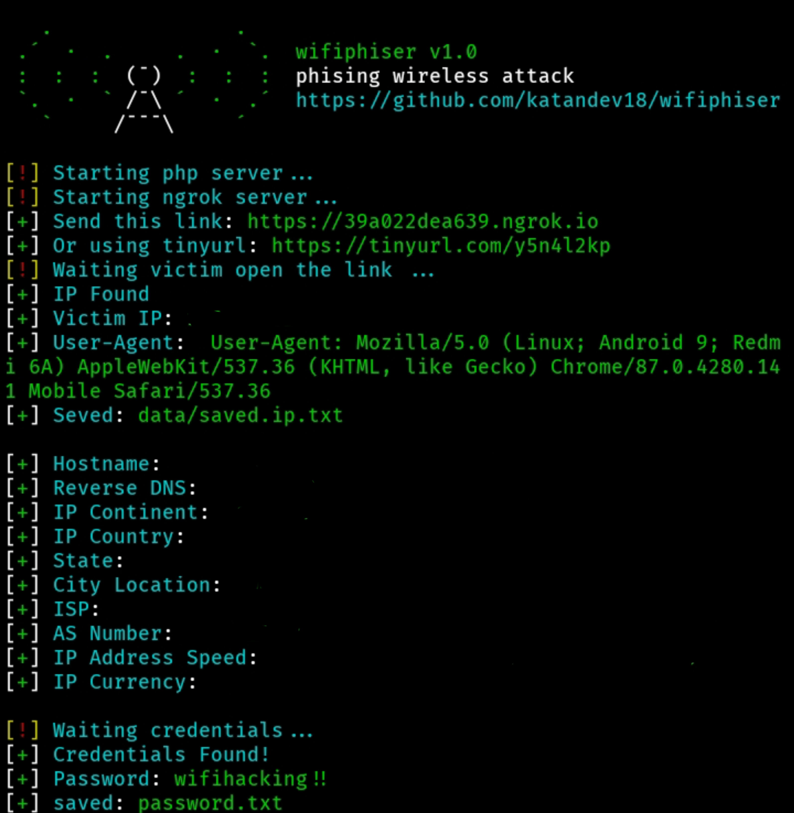

# WifiPhiser

```
What is a wifiphisher?
Wifiphisher is a wifi phishing attack
to get wifi password by phishing method
```

<p align="center">
  
</p>

[]()
[]()
[]()
[]()
[]()
[]()

# Wifiphiser installation

```
To install Wifiphiser you should
execute the following commands.
And save ngrok in the wifiphiser folder.
```
- [ngrok](http://ngrok.com)

# Linux
```
$ sudo apt-get install php bash curl wget
$ git clone https://github.com/katandev18/wifiphiser
$ cd wifiphiser
$ chmod 777 wifiphiser.sh
$ ./wifiphiser.sh
```

# Windows
- [php](https://www.php.net/downloads.php)
- [curl](https://curl.se/windows/)
- [python3](https://www.python.org/downloads/)
- [bash](https://git-scm.com/downloads)
```
Run wifihiser

$ ./wifiphiser.sh
```

# Demo
[](https://asciinema.org/a/Govx3EEzK2nHOPAo7KbXJ6XX9)

<p align="center">
  
</p>

- [Donasi](https://saweria.co/katandev18)
